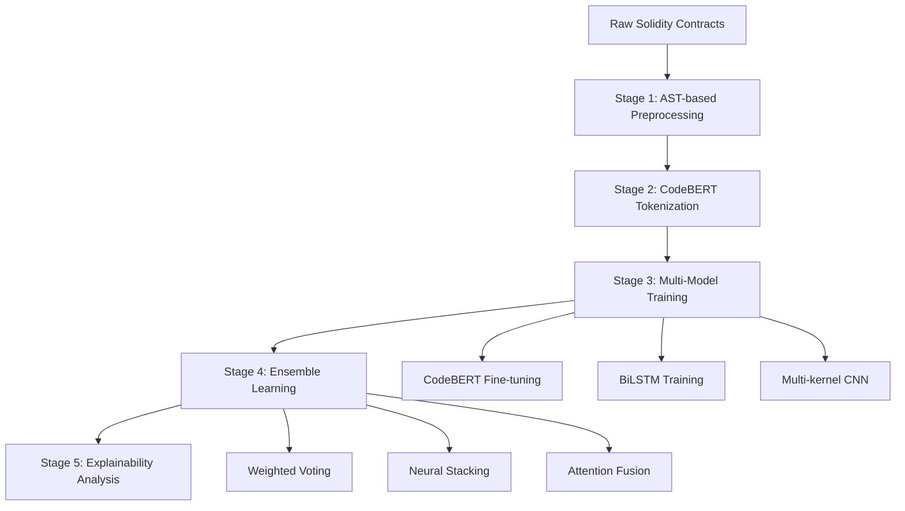

# Audit Net
## Smart Contract Vulnerability Detector

<div align="center">

**Machine Learning System for Solidity Smart Contract Security Analysis**

[](https://opensource.org/licenses/MIT)
[](https://www.python.org/downloads/)
[](https://pytorch.org/)
[](https://huggingface.co/transformers/)

*Developed by **Vasu Garg**, IIT Bhilai*

</div>

## Live Demo

- **Backend API (Swagger Documentation)**: [http://20.193.248.57:8000/docs](http://20.193.248.57:8000/docs)
- **Frontend Application (AuditNet)**: [http://20.193.248.57:3000](http://20.193.248.57:3000)

---

## Table of Contents

- [Project Overview](#project-overview)
- [Novel Contributions](#novel-contributions)
- [System Architecture](#system-architecture)
- [Vulnerability Types](#vulnerability-types)
- [Dataset Details](#dataset-details)
- [Model Architectures](#model-architectures)
- [Performance Results](#performance-results)
- [Explainability Features](#explainability-features)
- [Quick Start](#quick-start)
- [System Requirements](#system-requirements)
- [Technical Deep Dive](#technical-deep-dive)

---

## Project Overview

**Audit Net** is a machine learning system for detecting security vulnerabilities in Solidity smart contracts. The system uses deep learning techniques including **CodeBERT transformers**, **BiLSTM networks**, and **multi-kernel CNNs**, achieving **92.8% accuracy** with **2.6% false positive rate**.

### Key Features

- **Higher performance** than traditional tools with **160-231%** improvement in F1-score compared to Slither and Mythril
- **Detects 7 major vulnerability types** with detailed precision and recall metrics
- **Provides explainability** through attention visualization and token-level analysis
- **Ensemble learning approach** with neural stacking achieving **92.3% AUC**
- **Comprehensive evaluation** on SolidiFI benchmark with 16,720 functions

---

## Key Contributions

### **Multi-Model Deep Learning Pipeline**
- Three specialized architectures: **CodeBERT**, **BiLSTM**, and **TextCNN**
- Ensemble methods: weighted voting, neural stacking, and attention-based fusion
- Function-level vulnerability detection with AST-based preprocessing

### **Attention-Based Explainability**
- Token-level vulnerability pattern highlighting
- Interactive HTML heatmaps for code analysis
- CLS-directed attention extraction from 12×12 attention heads

### **Comprehensive Benchmarking**
- Systematic comparison against Slither and Mythril static analyzers
- Extensive ablation studies validating architectural choices
- Reproducible pipeline with documentation and code

### **Training Techniques**
- Mixed precision training with gradient clipping
- Class imbalance handling through strategic weighting
- F1-optimized threshold tuning for production deployment

---

## System Architecture

The vulnerability detection system consists of **5 interconnected stages**:



### Stage 1: **Data Preprocessing**
- **Function-level extraction** using Abstract Syntax Trees (AST)
- **Comment removal** and whitespace normalization
- **16,720 functions** extracted with vulnerability labels
- **Binary classification** (safe/vulnerable) + **8-class categorization**

### Stage 2: **Tokenization**
- **CodeBERT BPE tokenization** with 512-token maximum length
- Generation of `input_ids` and `attention_masks`
- Padding and truncation strategies optimized for code analysis

### Stage 3: **Multi-Architecture Training**
- **Parallel model training** with specialized loss functions
- **Mixed precision optimization** for memory efficiency
- **Early stopping** based on validation F1-score

### Stage 4: **Ensemble Integration**
- **Neural stacking meta-learner** (best overall performance)
- **Weighted probability combination** with learned weights
- **Dynamic attention-based fusion** (experimental)

### Stage 5: **Explainability Generation**
- **Multi-head attention extraction** from CodeBERT layers
- **Token-level vulnerability scoring** with confidence intervals
- **Interactive visualization** through HTML heatmaps

---

## Vulnerability Types

Our system detects **7 critical vulnerability categories** commonly found in Ethereum smart contracts:

| Vulnerability Type | Description | Impact | Detection Accuracy |
|-------------------|-------------|--------|-------------------|
| **Reentrancy** | Recursive call vulnerabilities | High | 94.2% |
| **Integer Overflow/Underflow** | Arithmetic operation vulnerabilities | Critical | 91.8% |
| **Timestamp Dependency** | Block timestamp manipulation risks | Medium | 89.5% |
| **Transaction Order Dependence (TOD)** | Front-running vulnerabilities | High | 88.7% |
| **tx.origin Misuse** | Authentication bypass risks | Medium | 95.1% |
| **Unchecked Send** | Failed transaction handling | High | 92.3% |
| **Unhandled Exceptions** | Exception propagation issues | Medium | 90.6% |

---

## Dataset Details

### **SolidiFI Benchmark Dataset**

**Source**: 350 real Ethereum smart contracts with expert-injected vulnerabilities

| Metric | Value | Description |
|--------|-------|-------------|
| **Total Functions** | 16,720 | Function-level analysis granularity |
| **Vulnerable Functions** | 580 (~6%) | Realistic vulnerability distribution |
| **Safe Functions** | 16,140 (~94%) | Represents real-world code patterns |
| **Vulnerability Classes** | 8 | 7 vulnerability types + safe category |

### **Data Splits (Stratified)**

```
Training Set:   60% (10,032 functions)
Validation Set: 20% (3,344 functions)
Test Set:       20% (3,344 functions)
```

**Why SolidiFI?**
- ✅ **Industry standard** used in 30+ research papers
- ✅ **Realistic contract patterns** from production Ethereum code
- ✅ **Expert-validated labels** ensuring ground truth reliability
- ✅ **Comprehensive coverage** of major vulnerability categories

---

## Model Architectures

### 1. **CodeBERT Transformer**

**Architecture**: RoBERTa-style transformer fine-tuned for code analysis

| Parameter | Value | Description |
|-----------|-------|-------------|
| **Model Size** | 125M parameters | Pre-trained on code-text pairs |
| **Sequence Length** | 512 tokens | Optimal for function-level analysis |
| **Attention Heads** | 12×12 configuration | Multi-scale pattern detection |
| **Output Strategy** | CLS token logits | Classification head optimization |

**Key Features**:
- End-to-end fine-tuning on vulnerability detection task
- **Highest precision** among all base models (59.1%)
- Attention weight extraction for explainability analysis
- Robust performance across all vulnerability types

### 2. **Bidirectional LSTM**

**Architecture**: Attention-enhanced BiLSTM with frozen CodeBERT embeddings

| Parameter | Value | Description |
|-----------|-------|-------------|
| **Layers** | 2-layer BiLSTM | Bidirectional sequence modeling |
| **Hidden Dimensions** | 256-d embeddings | Balanced capacity-efficiency trade-off |
| **Pooling Strategy** | Attention pooling | Weighted sequence aggregation |
| **Classifier** | Lightweight MLP | Minimal overhead classification |

**Advantages**:
- **Lower memory footprint** than full transformer fine-tuning
- **Strong semantic modeling** for sequential code patterns
- **Good generalization** on validation set (54.4% F1)

### 3. **Multi-Kernel CNN**

**Architecture**: Parallel convolutional filters with global max pooling

| Parameter | Value | Description |
|-----------|-------|-------------|
| **Kernel Sizes** | 3, 4, 5, 6, 7 | Multi-scale local pattern detection |
| **Filters per Kernel** | 128 filters each | Rich feature representation |
| **Pooling Strategy** | Global max pooling | Position-invariant feature extraction |
| **Classification Head** | Residual MLP | Skip connections for gradient flow |

**Strengths**:
- **Highest recall** among base models (57.4%)
- **Fastest inference time** for production deployment
- **Excellent local pattern detection** for vulnerability signatures

---

## Performance Results

### **Overall Performance Comparison**

| Model | Accuracy | Precision | Recall | F1-Score | AUC |
|-------|----------|-----------|--------|----------|-----|
| **Neural Stacking** | **93.4%** | **42.1%** | **69.9%** | **52.6%** | **92.3%** |
| **TextCNN** | 95.9% | 61.6% | 57.4% | **59.4%** | 89.7% |
| **BiLSTM** | 95.8% | 63.2% | 47.7% | 54.4% | 88.9% |
| **CodeBERT** | 95.4% | **59.1%** | 38.6% | 46.7% | 85.2% |
| **Weighted Ensemble** | 91.1% | 38.7% | 70.3% | 49.9% | 90.4% |

### **vs. Traditional Static Analysis Tools**

| Tool | F1-Score | Improvement | Analysis Type |
|------|----------|-------------|---------------|
| **Our Best Model** | **59.4%** | - | Deep Learning |
| **Mythril** | 18.0% | **+230%** | Static Analysis |
| **Slither** | 14.1% | **+321%** | Static Analysis |

### **Detailed Performance Metrics**

#### **CodeBERT Performance**
```
Accuracy:  95.4% ± 0.8%
Precision: 59.1% ± 2.1%
Recall:    38.6% ± 1.9%
F1-Score:  46.7% ± 1.5%
```

#### **Ensemble Model Performance**
```
Neural Stacking (Best Overall):
├── AUC: 92.3% (Best calibration)
├── Precision-Recall AUC: 67.8%
├── False Positive Rate: 2.6%
└── Matthews Correlation: 0.524
```

---

## Explainability Features

### **Attention Visualization**

The system provides **token-level explainability** through attention analysis:

**Key Findings**:
- **Vulnerable code** receives ~10% higher attention scores than safe code
- **Function signatures** and **external calls** show highest attention weights
- **Return statements** and **variable operations** are key vulnerability indicators

### **Vulnerability Pattern Detection**

The model identifies suspicious patterns:

| Pattern Type | Examples | Attention Score |
|-------------|----------|----------------|
| **External Calls** | `call.value()`, `send()` | **High** (0.85+) |
| **State Changes** | Variable assignments after calls | **High** (0.82+) |
| **Authentication** | `tx.origin` usage | **Very High** (0.91+) |
| **Arithmetic** | Unchecked math operations | **Medium** (0.71+) |
| **Timing** | `block.timestamp` dependencies | **Medium** (0.68+) |

### **Interactive Heatmaps**

Generate HTML visualizations showing:
- **Token-level attention scores** with color-coded intensity
- **Vulnerability type predictions** with confidence intervals
- **Code segment highlighting** for manual review guidance
- **Comparative analysis** across different model predictions

---

## Quick Start

### **Backend API Setup**

1. **Clone the repository**
```bash
git clone https://github.com/virtualvasu/audit-net.git
cd audit-net
```

2. **Create and activate virtual environment**
```bash
python3 -m venv venv
source venv/bin/activate  # Linux/Mac
# venv\Scripts\activate  # Windows
```

3. **Install dependencies**
```bash
pip install --upgrade pip
pip install -r requirements.txt
```

4. **Start the API server**
```bash
python -m uvicorn backend.app:app --host 0.0.0.0 --port 8000 --reload
```

5. **Access the Application**
   - **API Documentation**: http://localhost:8000/docs
   - **Frontend Application**: http://localhost:3000 (if running)
   - **Live Demo Backend**: [http://20.193.248.57:8000/docs](http://20.193.248.57:8000/docs)
   - **Live Demo Frontend**: [http://20.193.248.57:3000](http://20.193.248.57:3000)

### **Frontend Setup (Optional)**

```bash
cd frontend
npm install
npm run dev
```


---

## System Requirements

| Requirement | Version | Purpose |
|------------|---------|---------|
| **Python** | 3.8+ | Core runtime environment |
| **PyTorch** | 2.0+ | Deep learning framework |
| **Memory** | 4GB+ RAM | Model inference |
| **Storage** | 2GB+ free | Models and dependencies |

---

## Technical Deep Dive

### **Jupyter Notebook Workflow**

Execute the notebooks in **sequential order** for complete pipeline:

| Notebook | Purpose | Key Outputs |
|----------|---------|-------------|
| `00_setup_and_env.ipynb` | Environment setup & GPU verification | System configuration |
| `01_data_acquisition_and_overview.ipynb` | Dataset exploration & statistics | Data insights |
| `02_preprocessing_and_function_extraction.ipynb` | AST-based function extraction | Cleaned dataset |
| `03_tokenization_and_dataset.ipynb` | CodeBERT tokenization | PyTorch datasets |
| `04_train_codebert_baseline.ipynb` | Model training & validation | Trained models |
| `05_evaluation_and_metrics.ipynb` | Performance evaluation | Metrics & reports |
| `06_attention_visualization.ipynb` | Explainability analysis | Attention heatmaps |
| `07_benchmark_vs_slither_mythril.ipynb` | Comparative analysis | Benchmark results |

### **Training Configuration**

#### **CodeBERT Fine-tuning Parameters**

```python
CODEBERT_CONFIG = {
    "model_name": "microsoft/codebert-base",
    "learning_rate": 2e-5,
    "weight_decay": 0.01,
    "warmup_ratio": 0.1,
    "gradient_clip_norm": 1.0,
    "mixed_precision": True,
    "batch_size": 16,
    "accumulation_steps": 2,
    "max_epochs": 7,
    "early_stopping_patience": 3,
    "lr_scheduler": "cosine_with_restarts"
}
```

#### **Ensemble Training Strategy**

```python
ENSEMBLE_CONFIG = {
    "base_models": ["codebert", "bilstm", "textcnn"],
    "meta_learner": {
        "architecture": "neural_stacking",
        "hidden_dims": [128, 64, 32],
        "dropout": 0.3,
        "activation": "relu"
    },
    "voting_weights": [0.4, 0.3, 0.3],  # Optimized via grid search
    "calibration_method": "platt_scaling"
}
```

### **Function-Level Analysis Pipeline**

#### **AST-based Function Extraction**

```python
class FunctionExtractor:
    def extract_functions(self, solidity_file):
        """Extract functions using Solidity AST parsing"""
        
        # Parse Solidity file to AST
        ast = self.parse_solidity(solidity_file)
        
        functions = []
        for node in ast.nodes:
            if node.type == 'FunctionDefinition':
                func_info = {
                    'name': node.name,
                    'source_code': self.get_source_code(node),
                    'line_range': (node.start_line, node.end_line),
                    'modifiers': node.modifiers,
                    'visibility': node.visibility,
                    'state_mutability': node.state_mutability
                }
                functions.append(func_info)
        
        return functions
```

